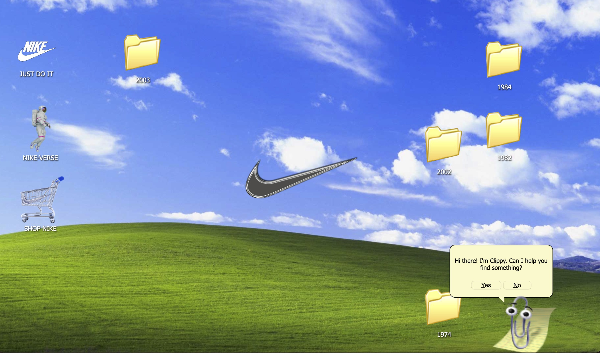
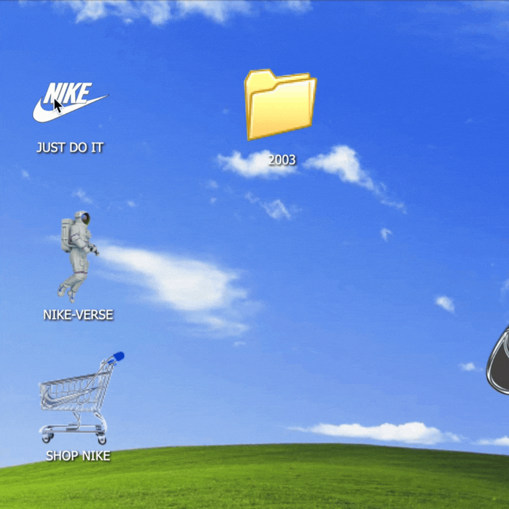

# Nike—Through the eras

*Nikeverse Homepage showcasing interactive features.*

## Overview
University coursework presenting Nike shoes through the eras, featuring a vapourwave/ Windows XP-inspired aesthetic. The icons were adapted using Photoshop and Illustrator, and pokes fun at past visions of *'the future'* while celebrating Nike's innovation and its steps into NFTs and the metaverse. This project is not affiliated with Nike in any way and is intended solely for educational purposes.

🔗 [Visit Website]( https://seecougsy.github.io/Nikeverse)

## Features
- Dynamic shoe information displayed in pop-up windows.
- Retro-style animations powered by GreenSock.
- Nike buffering animation created in Adobe Adobe After Effects.
- A "Clippy" helper (not fully functional) 

## Technologies Used
- **HTML5**: For structuring the webpage content.  
- **CSS3**: For styling and layout, including responsive designs.  
- **JavaScript**: For interactivity and dynamic elements.  
- **jQuery**: For simplifying DOM manipulation and event handling.  
- **GSAP (Greensock)**: For creating animations.  
- **Lottie**: For rendering animations.  
- **Design Tools**: Adobe Photoshop, After Effects, and Illustrator for creating and adapting visual assets.  

## Screenshots and Animations
<div style="display: grid; grid-template-columns: repeat(2, 1fr); gap: 10px;">
  
  
</div>

## Setup Instructions
1. Clone the repository:
   ```bash
   git clone https://github.com/seecougsy/nikeverse.git

