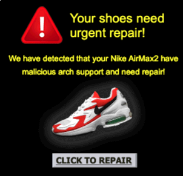

[](https://seecougsy.github.io/Nikeverse/)


---
## Overview
University coursework showcasing Nike shoes through the eras, a vapourwave and Windows XP-inspired aesthetic. Custom icons created in Photoshop and Illustrator—complete with intrusive pop-ups–a playful riff on past visions of 'the future' to celebrate Nike's innovation and venture into NFTs and the metaverse. This project is purely educational and not affiliated with Nike.


*Nikeverse Homepage showcasing interactive features.*

## Features
- Dynamic shoe information displayed in pop-up windows.
- Retro-style animations powered by GreenSock.
- Nike buffering animation created in Adobe Adobe After Effects.
- A "Clippy" helper (not fully functional)
- Complete with Nike'pop-ups'

## Technologies Used
- **HTML5**: For structuring the webpage content.  
- **CSS3**: For styling and layout, including responsive designs.  
- **JavaScript**: For interactivity and dynamic elements.  
- **jQuery**: For simplifying DOM manipulation and event handling.  
- **GSAP (Greensock)**: For creating animations.  
- **Lottie**: For rendering animations.  
- **Design Tools**: Adobe Photoshop, After Effects, and Illustrator for creating and adapting visual assets.  

## Screenshots and Animations
<div style="display: grid; grid-template-columns: repeat(2, 1fr); gap: 10px;">
  
  
</div>
<p float="left">
  
  
  
</p>

## Setup Instructions
1. Clone the repository:
   ```bash
   git clone https://github.com/seecougsy/nikeverse.git

